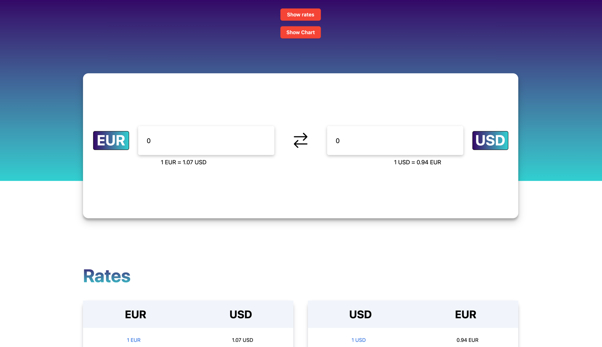

#Конвертер валют

## Описание задачи
Создать интерфейс приложения конвертера валют с загрузкой актуальных данных по API, возможностью просмотра истории курсов валют и простой настройкой интерфейса.

## Развертывание
1. npm i
2. создать файл .env
3. зайти на сайт https://app.freecurrencyapi.com/, зарегистрироваться и скопировать api ключ
4. вставить ключ в .env по примеру .env.example
5. npm run dev

## Пример

## Технологии
- React
- Typescript
- Effector
- CSS Modules
- SCSS
- Recharts - отрисовка графика

## Решение и Особенности
Для получения актуальных данных о валютах был использован сервис https://app.freecurrencyapi.com/

Возможность получения истории конвертации была убрана
из бесплатных версий просмотренных мной апи, поэтому для графика в моем проекте
используются шаблонные данные, находящиеся в /src/mock

Интерфейс приложения адаптирован под мобильные устройства.
